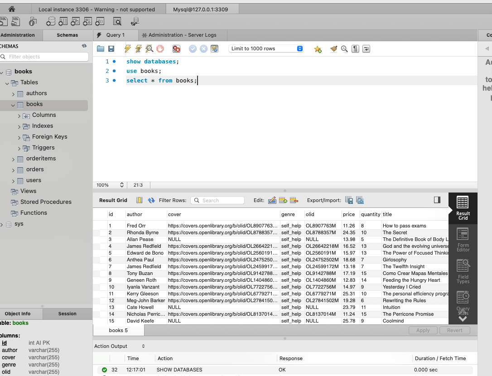

## Installation

Install both Docker and MySQLWorkBench on your system

From the root directory run 

   ```docker-compose build```
```docker-compose up```


Navigate to <mark>http://localhost:3000/</mark> on your browser to view the application


# Adding Data to MySQL

🛠️ Manual Data Import Guide (MySQL Workbench)
Once the Docker environment is running, follow these steps to manually inject data into the MySQL database using MySQL Workbench:

# ✅ Connection Details
From the Menu bar within Workbench, select Database -> Connect To Database 

Host: localhost

Port: 3309

Username: root

Password: (leave blank)

Database: books

# 📥 Importing CSV Files
Open MySQL Workbench and connect using the details above.

Navigate to your books database. (Schemas tab in the sub menu)

Right-click on the target table and select Table Data Import Wizard.

Select the books.json file (there's a books.json file within the db directory in root).

Click Next to preview and confirm the import.

Use the existing table (won't work if you overwrite/drop it)

💡 Tip: 

Validate it works by running the below queries 
```show databases```
```use books```
```select * from books```

The books table should be populated (see screenshot)




🧼 Troubleshooting
If connection fails, confirm Docker is running and port 3309 is not blocked.

